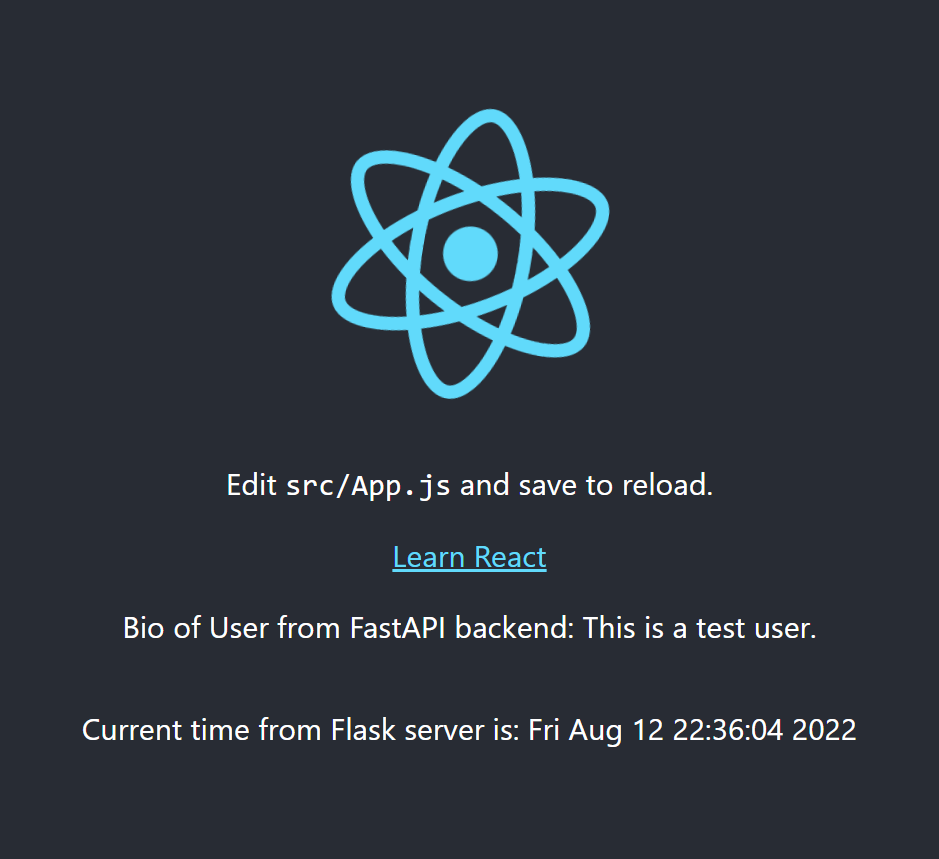

# Flask React App - using React CDN (Version 1.0) with FASTAPI
To have React as the frontend and Flask/FastAPI as the backend (server). 

## Setting up React with Flask
The folder structure will separate our concerns as follows:
```
/Flask-App (base directory)
├── /FlaskApp
|   ├──server (Has the backend functionality)
│       ├── __init__.py (Application Factory where app is initialized)
│       ├── forms
|           ├── forms.py
|       ├── fastAPI
|           ├── fastAPI Routers.py, Models.py and Schemas.py files
│       ├── models.py
│       ├── assests.py - Not needed as frontend served by React
│       └── /tests
|   ├──frontend (Has the frontend functionality)
│       ├── home
│       ├── forms
├── config.py (app configurations)
└── wsgi.py (imports and serves as our app gateway)
```
## Flask and React UseState and Proxy
Flask/FastAPI will send data via a proxy of the server url which is updated on the package.json file and a start-api is added under the scripts object under the same package.json
```
{
    ...,

    "proxy": "http://127.0.0.1:8000",
    
    ...,
}
```
To run the react and flask simultaneuosly to have flask backend api expose data which react will query via that url. Start first server.
```
> uvicorn wsgi:app
```
Run react with npm
```
> cd frontend/home 
> npm run start 
```
Data can be queried from FastAPI backend ('/') vs Flask backend('/vf/') based on route which data is fetched



Reads:
1. [FastAPI vs Flask](https://www.netguru.com/blog/python-flask-versus-fastapi#:~:text=When%20you're%20building%20APIs,tooling%20built%20around%20that%20framework.)
2. [Side by Side implementation of FastAPI and Flask](https://testdriven.io/blog/moving-from-flask-to-fastapi/#additional-features)
3. [FastAPI with Flask](https://www.youtube.com/watch?v=KKT6VpTfk_0)
4. [FastAPI with Relational Databases](https://www.youtube.com/watch?v=4Zy90rd0bkU)